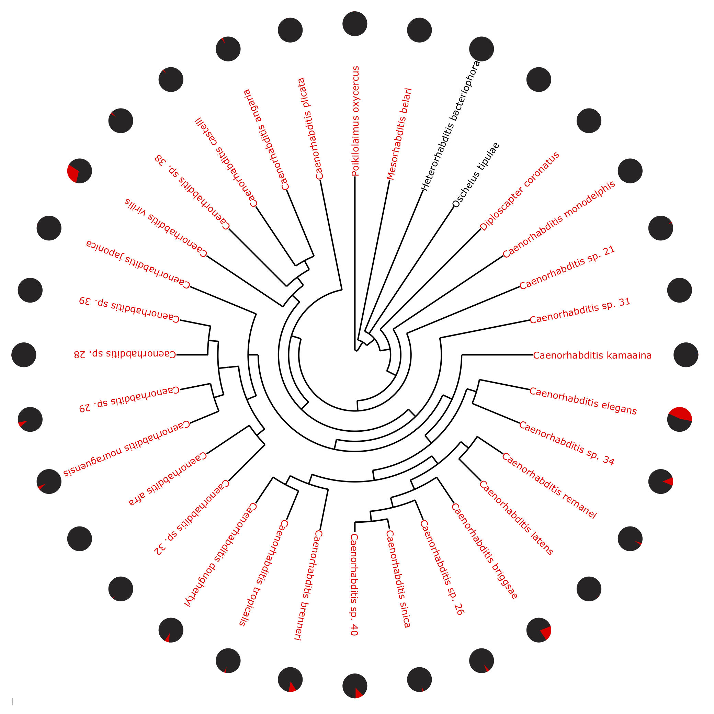

# Caenorhabditis-HSE-Helitrons
HSE-Helitron overlap analyses by bvtsu for Garrigues et al., 2019

## This work addresses the following:
### 1. Does enrichment of HSEs inside helitrons (red fraction) extend to other Caenorhabditis species?


Published work with CGP genomes suggest that other Caenorhabditis species have this signature.

## Dependencies
### 1. RepeatMasker (via conda)
```conda config --add channels bioconda```

```conda install -c bioconda repeatmasker```

### 2. FIMO (MEME Suite package)
Install all of MEME suite via this guide: http://meme-suite.org/doc/install.html?man_type=web
Edit: For step 3 of the installation, edit ~/.bash_profile to include the following (Assuming you installed it to your main directory)
```export PATH=$HOME/meme/bin:$HOME/meme/libexec/meme-5.3.0:$PATH```

## Usage:
#### 1. Visit http://download.caenorhabditis.org/v1/sequence/
#### 2. For species genomes of interest, select only the ".scaffolds.fa.gz" files.  Using the C. elegans and C. briggsae genomes as examples, download "Caenorhabditis_elegans_WBcel235.scaffolds.fa.gz" and "Caenorhabditis_briggsae_CB4.scaffolds.fa.gz" by using the checkbox on the top-left of each file name to select multiple files followed by clicking the download icon on the top-left portion of the webpage (next to the search icon). To conduct the entire analyses, simply select every single ".scaffolds.fa.gz" file to download. (Bonus point challenge: Figure out a way to wget these files and assign it to me in a task)
#### 3. Move all locally downloaded files to a "genome" folder in your TSCC account using scp. Enter your university Active Directory password when prompted.
```scp ~/Folder-With-Genomes/*.scaffolds.fa.gz username@tscc-login.sdsc.edu:~/genomes```
#### 4. Log into TSCC and enter your university Active Directory password when prompted.
```ssh username@tscc-login.sdsc.edu```
#### 5. Create a working folder/git clone the repository of interest and relevant datafolders for outputs

```git clone https://github.com/daugherty-lab/Caenorhabditis-HSE-Helitrons/ subproject/```
#You will be prompted for your github credentials, as this is a private repo

```cd subproject```

```git filter-branch --prune-empty --subdirectory-filter Caenorhabditis_genomes_project HEAD```

```mkdir ~/data/fimo_cgp_default/```

```mkdir ~/data/rmsk.out.cgp/```

```mkdir ~/subproject/log/```
#### 6. Navigate to your genomes folder and create a file from your directory list of "scaffolds.fa.gz" files.
```cd ~/genomes```
```ls | grep scaffolds | rev | cut -d . -f 3- | rev > ~/subproject/CGP_planfile.txt```

#### 7. Navigate to the subproject folder and edit the bash script "submit_rmsk_cgp.sh"
```cd ~/subproject/```

Using any text editor, replace "bvtsu" with your own tscc username in the submit_rmsk_cgp.sh file. (Example: vim)
```vim submit_rmsk_cgp.sh``` #open vim editor

```:%s/bvtsu/yourusername/g``` #Hit enter

```:wq``` #Save changes

#### 8. Navigate to the src folder and edit the rmsk_default_cgp.sbatch file
```cd src```

```vim rmsk_default_cgp.sbatch``` #open vim editor

```:%s/bvtsu/yourusername/g``` #Hit enter

```:wq``` #Save changes

#### 9. Return to subproject and execute "submit_rmsk_cgp.sh"
```cd ..```

```chmod +x submit_rmsk_cgp.sh```

```./submit_rmsk_cgp.sh``` 

#### 10. Execute the "submit_hse_helitron_counter.sh". [INCOMPLETE]
```./submit_hse_helitron_counter.sh``` 

#### 11. Your output should now have a summary table of fractions of HSEs inside or outside of helitrons.
