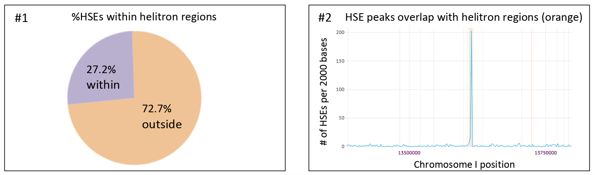
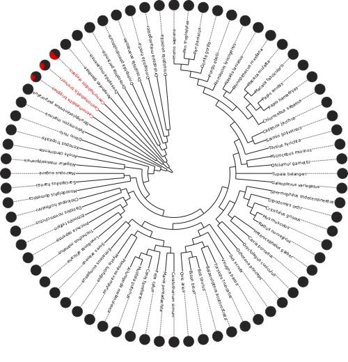

# Caenorhabditis-HSE-Helitrons
HSE-Helitron overlap analyses by bvtsu for Garrigues et al., 2019
https://elifesciences.org/articles/51139

Heat Shock elements (HSEs) in this project are shorthand for the Hsf-1 binding motif.
Published work demonstrates that mobile elements known as helitrons transport HSEs around Caenorhabditis genomes, and has the potential to rewire transcription regulatory networks.

## Early analyses by Garrigues (Pasquinelli) demonstrated: 
### 1. Enrichment of HSEs inside C. elegans helitrons (Note: These early values are based off of the MEME motif, rather than the later-adopted regex motif search).
### 2. Large HSE peaks in helitrons



## Follow-up analyses by bvtsu (Daugherty) addressed:
### 1. Does enrichment of HSEs inside helitrons (red fraction) extend to other Caenorhabditis species?


Published work with CGP genomes suggest that other Caenorhabditis species have this signature.

### 2. Does enrichment of HSEs inside helitrons (red fraction) extend outside of Caenorhabditis species?


Published work with UCSC genomes suggest that this is specific to Caenorhabditis.

However, extension of this work into i5k insect genomes suggests this phenomenon may exist in mosquitoes (Figure not shown - See Table 1 in i5k folder). Follow-up work has been done by bryantcao (see repo: mosquito-transcriptomics)

### 3. In non-Caenorhabditis species, do we see large HSE peaks (indicative of movement by uncalled helitrons or other mobile elements)?

Similar response as with 2. More conclusive data will come from mosquito genome analyses by bryantcao.

## Dependencies
### 1. RepeatMasker (via conda)
```conda config --add channels bioconda```

```conda install -c bioconda repeatmasker```
### 2. twoBitToFa (UCSC Genome Browser tool)
```wget -P ~/ http://hgdownload.soe.ucsc.edu/admin/exe/linux.x86_64.v369/twoBitToFa```
## Usage
Because the datascraping differs by resource, see folder-specific README.md files for details

## Missing
1. Tajima's D ipynb
2. fisher exact
