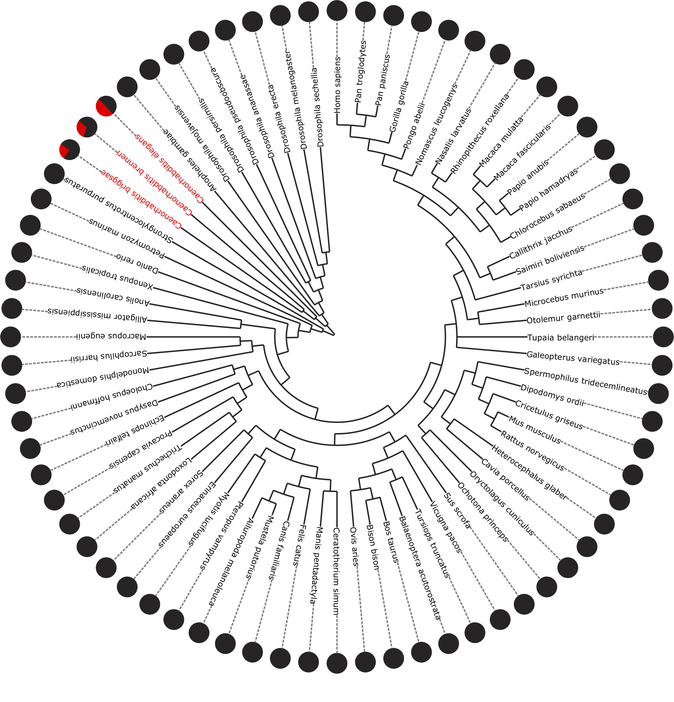

# Caenorhabditis-HSE-Helitrons
This repository is a series of HSE-Helitron overlap analyses created by bvtsu for [Garrigues et al., 2019](https://elifesciences.org/articles/51139). This HPC pipeline is controlled by `bash` commands to take a list of UCSC Genome Browser database-specific genome names (e.g. ce11 for Caenorhabditis elegans via UCSC) and uses them to create unique `Torque` jobs and run scripts and pre-built software contained in the `src/` directory.


Published work with UCSC genomes suggest that this high % of HSEs in helitrons (red slice) is specific to Caenorhabditis.

# In progress/planned
1. Refining python code to typehint and proper PEP8 style
2. Adding comment blocks to annotate code
3. Adding ETE3 pie chart analyses
4. Wormbase, Caenorhabditis Genome Project

# Installing/Prerequisites
1. Install [miniconda](https://docs.conda.io/en/latest/miniconda.html#macos-installers)
2. Install RepeatMasker via conda (Optional: These genomes already have well-curated rmsk files associated with these databases)
    ```
    conda config --add channels bioconda
    conda install -c bioconda repeatmasker
    ```
3. twoBitToFa (Tool specifically for UCSC Genome Browser genomes)
    ```
    wget -P ~/ http://hgdownload.soe.ucsc.edu/admin/exe/linux.x86_64.v369/twoBitToFa
    ```
    * Alternatively:
    ```
    conda install --yes -c bioconda ucsc-twobittofa
    ```
4. python 3.9 (not tested with other versions)
    ```
    conda install --yes python=3.9
    ```
5. other dependencies via conda
    ```
    conda install --yes pandas numpy
    ```

# Usage
HPC usage will be demonstrated using a copy of the `tests/integration` planfile entries as an example.
1. Loop through planfile (.txt) of genome names to run again pipeline
    ```
    ./ucsc_process_helitrons.sh -i '/Path/to/repo/planfile_rmsk_sample.txt' -o '/Path/to/outfolder'
    ```
2. Make summaries -> `Path/to/outfolder/HSE_in_out_summary.txt`
    ```
    python summary.py -genomes '/Path/to/repo/planfile_rmsk_sample.txt' -o '/Path/to/outfolder'
    ```

# Testing
Local usage will be demonstrated using the `tests/integration` planfile
1. Loop through planfile (.txt) of genome names to run again pipeline
    ```
    ./ucsc_process_helitrons_local.sh -i '/Path/to/repo/Caenorhabditis-HSE-Helitrons/tests/integration/planfile_rmsk_subset.txt' -o '/Path/to/repo/Caenorhabditis-HSE-Helitrons/tests/integration'
    ```
2. Make summaries -> `tests/integration/HSE_in_out_summary.txt`
    ```
    python summary.py -genomes '/Path/to/repo/Caenorhabditis-HSE-Helitrons/tests/integration/planfile_rmsk_subset.txt' -o '/Path/to/repo/Caenorhabditis-HSE-Helitrons/tests/integration'
    ```

Functional testing was done using HPC resources.